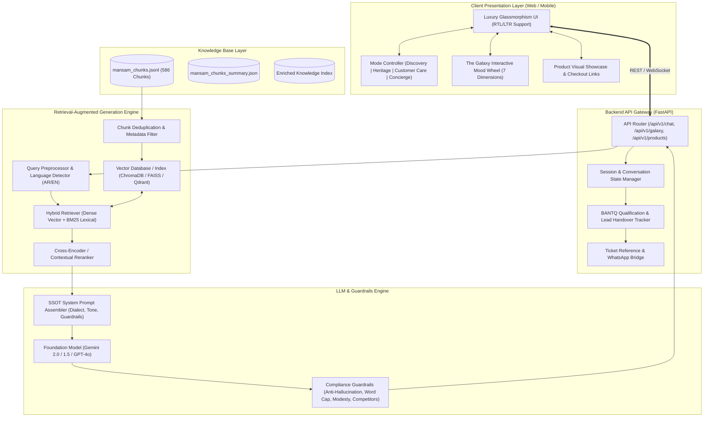
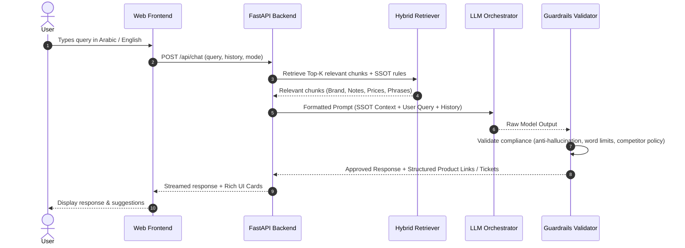

# 🏛️ System Architecture Design — Mansam Luxury Fragrance AI Concierge

> **Document Version:** 1.0.0  
> **Target System:** Unified Hybrid Luxury RAG Concierge Suite  
> **Brand Target:** Mansam Fine Fragrances (Kingdom of Saudi Arabia)  
> **Supported Languages:** Arabic (Saudi / Khaleeji luxury register) & English (Refined luxury tone)

---

## 1. Executive Summary

The **Mansam Luxury Fragrance AI Concierge** is an intelligent, bilingual, omnichannel conversational and discovery suite. It leverages Retrieval-Augmented Generation (RAG) grounded in the Single Source of Truth (SSOT) data from [`mansam_chunks.jsonl`](file:///k:/projects/RAG/mansam_chunks.jsonl), covering brand philosophy, historical Arabic perfumery lore (Al-Kindi & Ibn al-Jazzar), the 7-mood *Galaxy* fragrance classification, product catalogs (EDPs, Attars, Bukhoor, Diffusers), boutique networks, and commercial concierge protocols.

---

## 2. High-Level Architecture Diagram



---

## 3. Component Details & Subsystems

### 3.1. Client Presentation Layer (Frontend)
* **Aesthetics:** Ultra-luxury minimalist design with deep dark velvet/emerald tones, gold accents (`#D4AF37`), subtle glassmorphism, and responsive typography.
* **Bilingual Dual-Layout:** Seamless dynamic switching between **Arabic (RTL)** and **English (LTR)** with authentic Khaleeji cultural aesthetics.
* **Interactive Modules:**
  1. **Omnichannel Chat Interface:** Real-time conversational streaming with suggested prompts.
  2. **The Galaxy Wheel:** Interactive radial selector exploring the 7 emotional categories (*Nobility, Pride, Pleasure, Passion, Generosity, Happiness, Desire*).
  3. **Rich Product Cards:** Showing notes pyramid (Top, Heart, Base), pricing (SAR, AED, USD), size variants (100ml / 12ml), and direct checkout URLs.
  4. **Lead & Advisor Connect:** One-click ticket generation and WhatsApp advisor dispatch (+966 53 982 2844 / +971 54 485 4544).

---

### 3.2. Backend API Service (FastAPI)
* **Asynchronous High Performance:** Built on Python `FastAPI` with `uvicorn` and `asyncio`.
* **Endpoints:**
  * `POST /api/chat`: Handles conversational queries, context retrieval, session history, and streaming completions.
  * `GET /api/galaxy`: Returns emotional categories, associated fragrance lists, and matching notes.
  * `GET /api/products`: Full product search, filterable by family, notes, collection, and price tier.
  * `POST /api/lead/ticket`: Creates concierge reference ticket IDs (`TICK-XXXXXX`) for handover to human advisors.
  * `GET /api/health`: System health check and index status.

---

### 3.3. RAG Retrieval & Ingestion Pipeline
* **Data Cleansing & Ingestion:**
  * Deduplicates the 26 colliding chunk IDs found in `23_Product_Links` and `17_Opening_Greetings` by composite indexing (`sku_size` and `id_lang`).
  * Ingests 586 chunks categorized into `brand_booklet`, `instore_product_booklet`, and `ssot_record`.
* **Hybrid Search Strategy:**
  * **Dense Semantic Search:** Multilingual embedding model (e.g., `text-embedding-3-small`, `bge-m3`, or `multilingual-e5`) to capture deep intent in both Arabic and English.
  * **Lexical / BM25 Search:** Exact match on product names, SKUs, boutique cities, notes, and pricing figures.
  * **Reciprocal Rank Fusion (RRF):** Blends vector similarity and BM25 scores for maximum retrieval precision.

---

### 3.4. LLM Orchestrator & Guardrails Engine



#### SSOT Compliance Rules Enforced in Prompts & Guards:
1. **Brand Voice:** Refined, modest, hospitable Khaleeji Arabic or elegant English.
2. **Pricing & Offers Strictness:** Only quote authoritative prices (SAR 1,150 Oud Collection / SAR 850 Standard Collection; complimentary 12ml with 100ml purchase). Never invent discounts.
3. **Competitor Policy:** Never disparage competitors; redirect politely to Mansam’s unique Arab heritage and French craftsmanship.
4. **BANTQ & Word Economy:** Keep conversational turns succinct (25–40 words for sales interactions, deeper for historical inquiries) with clear call-to-actions.

---

## 4. Directory & Project File Structure

```
k:/projects/RAG/
│
├── SYSTEM_ARCHITECTURE.md            # System Architecture & Design Specification (this file)
├── README.md                          # Quickstart, Setup & Usage Guide
├── requirements.txt                   # Python dependencies
├── .env.example                       # Environment variables template
├── config.py                          # Application settings & constants
│
├── data/
│   ├── mansam_chunks.jsonl            # Raw input chunks
│   ├── mansam_chunks_summary.json     # Summary metadata
│   └── processed_chunks.jsonl         # Deduplicated and enriched chunks
│
├── app/
│   ├── __init__.py
│   ├── main.py                        # FastAPI application entrypoint
│   │
│   ├── core/
│   │   ├── config.py                  # Global settings (Pydantic)
│   │   ├── guardrails.py              # Output validation & hallucination checks
│   │   └── prompts.py                 # System prompts (Bilingual, Khaleeji, Tone)
│   │
│   ├── rag/
│   │   ├── __init__.py
│   │   ├── ingest.py                  # Ingestion, deduplication & indexing script
│   │   ├── retriever.py               # Hybrid search (Dense + BM25)
│   │   └── embeddings.py              # Embedding provider wrapper
│   │
│   ├── services/
│   │   ├── chat_service.py            # Chat session orchestration
│   │   ├── galaxy_service.py          # The Galaxy 7-mood logic
│   │   ├── ticket_service.py          # BANTQ lead ticket generator
│   │   └── product_service.py         # Product catalog queries
│   │
│   └── api/
│       ├── __init__.py
│       ├── routes_chat.py             # Chat streaming endpoints
│       ├── routes_galaxy.py           # Galaxy mood wheel endpoints
│       └── routes_products.py         # Product & boutique endpoints
│
└── frontend/
    ├── index.html                     # Luxury Glassmorphism single-page app
    ├── css/
    │   └── styles.css                 # Gold/velvet dark theme, RTL/LTR styling
    └── js/
        ├── app.js                     # State management, API integration
        ├── chat.js                    # Chat UI controller & streaming
        └── galaxy.js                  # The Galaxy interactive wheel
```

---

## 5. Security, Reliability & Quality Assurance

* **Data Integrity:** Strict grounding in [`mansam_chunks.jsonl`](file:///k:/projects/RAG/mansam_chunks.jsonl) to eliminate hallucinations.
* **API Protection:** Rate limiting per IP/Session, input sanitization against prompt injection.
* **Offline Fallback:** Local BM25 fallback when external embedding APIs are throttled.
* **Privacy:** Customer phone/WhatsApp details captured during ticket handovers are processed securely without third-party exposure.
